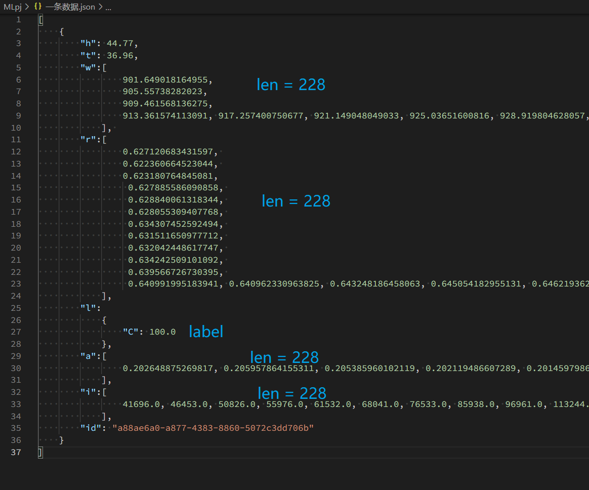

## 任务1：定性分析（布眼数据集）
### 1.1 混合材质纺织物，由纯棉（Cotton）和棉混纺（Cotton+X）组成 本任务为二分类
### 1.2 关于数据集
老师给的"布眼数据集.json"有一条数据有问题需要去掉，去掉之后的"布眼数据集fixed.json"共有70026条数据，下载地址为 https://drive.google.com/file/d/1SBX_lIny3KfxX2JOaePPnQWNBavSvGs5/view?usp=sharing

一条数据的格式：

### 1.3 评测指标：Accuracy，目前最好能到 92.5%
### 1.4 运行 pj2.py
先设置文件开头的 DATAPATH 变量。
每次运行随机取10000条作为验证集，10000条作为测试集，剩下的50026条作为训练集

## 任务2：定量分析
### 2.1 混合材质纺织物，由棉（Cotton）和聚酯纤维（Poly）组成 本次任务为预测织物中Poly的含量
### 2.2 评测指标：MAE（平均绝对值误差），目前最好能到 0.075
### 2.3 运行 pj3.py
先设置文件开头的 DATAPATH 变量。